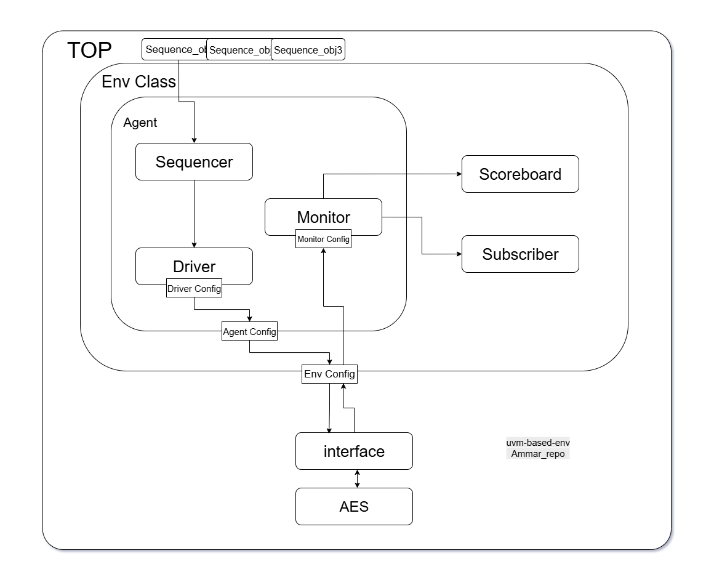
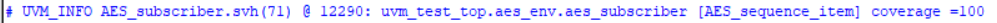
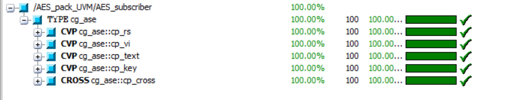

# AES-UVM-Based Verification

## Overview

This project implements a UVM-based verification environment for the AES-Verilog
 design. The testbench verifies AES-128 encryption by generating random and directed transactions, driving them to the DUT, and checking the output against a Python golden reference model.

The verification achieved 100% functional coverage with randomized seeds.

---

## ⚙️ Features
- UVM-based testbench architecture  
  - Agent (sequencer, driver, monitor)  
  - Scoreboard with Python golden reference  
  - Subscriber for coverage collection  
- Python AES model for reference checking  
- Configurable random seed (`-sv_seed`)  
- Functional coverage report generation  
- Achieved **100% coverage** on AES-128 design  

---

## Enviroment


---
## ▶️ Running the Simulation

### 1. Compile & Run (Questa/ModelSim)
From your simulator console:
```tcl
do AES_UVM.do
```

### 2. Example `.do` File
```tcl
vlog AES_128_regs.sv AES_pack_UVM.sv AES_top.sv AES_interface.sv +cover
vsim AES_top -novopt -cover -coverage -suppress 12110 -sv_seed random
add wave -r /*
coverage save AES_top.ucdb -onexit
run -all;
vcover report AES_top.ucdb -details -all -annotate -output AES_UVM_cvr.txt
```
---

## Coverage 



---
## Directory Structure

```
AES-UVM-Based-Verification/
│
├── RTL/  
│   └── AES-Verilog-main/           # Original AES design (DUT)  
│       ├── AES_128_regs.sv  
│       ├── AES_cipher.v  
│       ├── AES_key_expand.v  
│       ├── ... (other RTL files)  
│
├── TB/                             # UVM testbench files  
│   ├── AES_agent.svh  
│   ├── AES_driver.svh  
│   ├── AES_env.svh  
│   ├── AES_interface.sv  
│   ├── AES_monitor.svh  
│   ├── AES_pack_UVM.sv  
│   ├── AES_scoreboard.svh  
│   ├── AES_sequence.svh  
│   ├── AES_sequence2.svh  
│   ├── AES_sequence_item.svh  
│   ├── AES_sequence_keys.svh  
│   ├── AES_sequence_rand.svh  
│   ├── AES_sequencer.svh  
│   ├── AES_subscriber.svh  
│   ├── AES_test.svh  
│   ├── AES_top.sv  
│   └── AES_UVM.do                  # Simulation script  
│
├── Python_code/                    # Python golden reference model  
│   ├── aes_enc.py  
│   ├── key.txt
│   └── output.txt
│
├── pics/                           # Figures 
│   └── ...  
│
├── AES_UVM_cvr.txt                 # Coverage report (generated after sim)  
└── README.md                       # Project documentation  
```
---

## 🔗 References
- [AES-Verilog design](https://github.com/michaelehab/AES-Verilog) (DUT)  
